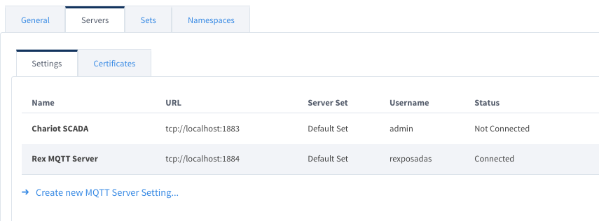
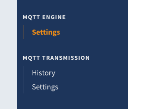
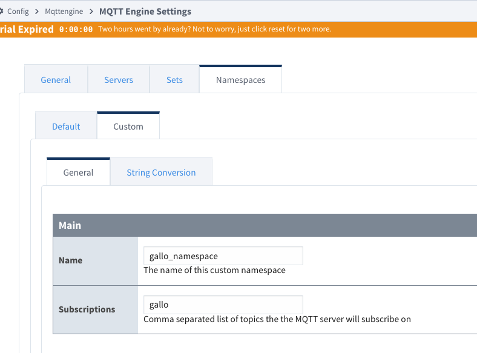
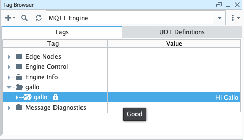

# MQBroker

This is a "How To" guide on how to create and use a custom MQTT broker in an 
Ignition application.

The custom MQTT Broker was written in Go.

This example assumes that MQTT Engine and Transmission modules has been installed.

# Links

[Modules Overview](https://docs.inductiveautomation.com/docs/8.1/getting-started/modules-overview)
[Modules Downloads](https://inductiveautomation.com/downloads/third-party-modules/8.1.44)


# Preparations

My version of ignition was installed in a Mac OS

    ./ignition.sh start

That exposes the gateway on  localhost:8088. 

# Steps to integration a custom MQTT Broker 

1. Create an MQTT Broker and expose it via a port ( in our example we use port 1884 ).
2. Integrate with Ignition
3. Send message to a topic and check Designer display.


# Step 1:  Create MQTT Broker

`main.go` has the code which builds a server and exposes port `1884`. 

Key part of the Go code is below with comments

```go
// These are MQTT libraries used to start up the server
mqtt "github.com/mochi-co/mqtt/server"
"github.com/mochi-co/mqtt/server/listeners"
	
// Custom port so we distinguish it from the default MQTT port of 1883
port := ":1884"


// Listen on TCP
tcp := listeners.NewTCP("tcp1", port)

// Add the listener to the server
err := server.AddListener(tcp, nil)

// Start the server
if err := server.Serve(); err != nil {

```


To run this server go to a terminal and type: 

    go run main.go

That should display a message that it is listening in port 1884:

    Starting MQTT broker on port :1884...

To test this, you can manually send a message and see if the server received it.

In one terminal subcribe to a topic with `mosquitto`.  The call below subscribes to an
mqtt server in port 1884 on a toic called `gallo`: 

    mosquitto_sub -h localhost -p 1884 -t gallo

In another terminal send a message to that topic:

    mosquitto_pub -h localhost -p 1884 -t gallo -m "Hi Gallo"

Check the previous terminal and you will see a message like so: 

    mosquitto_sub -h localhost -p 1884 -t gallo
    Hi Gallo

Receiving that message indicates the the MQTT Broker is working.


# Step 2: Integrate with Ignition

Install the MQTT Engine and Transmission module. You should have these options on the left Navigation bar:







In `MQTT Engine > Settings` create a custom namespace with a topic called `gallo`. 
This is the topic that we will send a message to.  Ignition listens to this topic and sets the tag to the value of 
the message. 




# Step 3: Send message and check display

Send the message from the terminal to the MQTT Broker. Ignition, which is listening to that topic, will replace the 
tag with the message value. 

    mosquitto_pub -h localhost -p 1884 -t gallo -m "Hi Gallo"


Go to the Designer and see that the value for the tag `gallo` was changed to the message `Hi Gallo`. That's the 
message sent to the MQTT topic.




